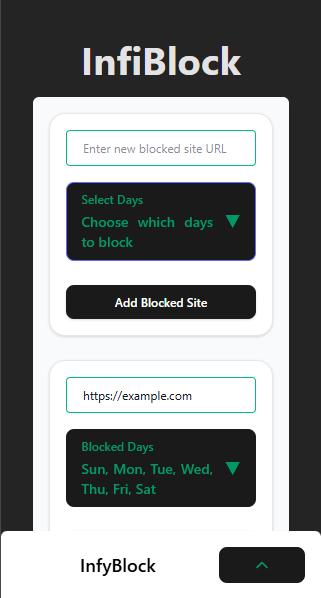
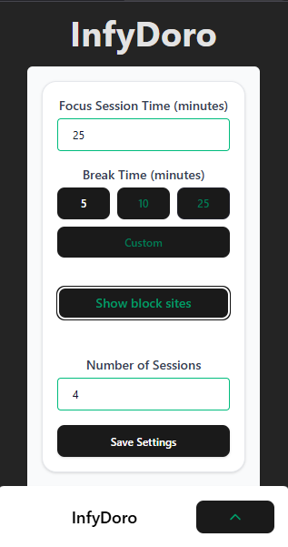

# Unlimited Block Sites

A free and open-source browser extension suite offering two powerful productivity tools: InfyBlock and InfyDoro.

## Our Products

### InfyBlock


A flexible website blocker that helps you stay focused by blocking distracting websites.
- **Unlimited Blocking**: Block any number of websites
- **Flexible Duration**: Set blocking periods for any number of days
- **Customizable Rules**: Create blocking schedules that fit your workflow

### InfyDoro


A customizable Pomodoro timer designed to help you maintain focus and productivity.
- **Focus Sessions**: Block distracting websites during focus periods
- **Break Management**: During breaks, normal website access is restored
- **Session Tracking**: Monitor your productivity with session tracking

## Features

- **100% Free**: No hidden fees, no premium tier, completely free
- **Open Source**: Full source code available for review, modification, and contribution
- **Privacy Focused**: No data collection or tracking
- **Lightweight**: Minimal resource usage to keep your browser running smoothly
- **Clean Interface**: Minimalist design with a smooth progress indicator
- **Fully Customizable**: Adjust all settings to match your workflow

## How It Works

### InfyBlock
1. Add any websites you want to block to your blocklist
2. Set the duration for how long you want sites to be blocked (hours, days, weeks)
3. Activate blocking with a single click
4. When you try to visit a blocked site, you'll be redirected to a friendly reminder page
5. Adjust or remove blocks at any time

### InfyDoro
1. Add distracting websites to your block list
2. Set your preferred focus and break durations
3. Choose the number of work sessions
4. Click "Save Settings" to lock in your preferences
5. Start your timer and focus on your work
6. During focus sessions, blocked sites will be inaccessible
7. During breaks, normal website access is restored
8. When the cycle completes, you'll receive a notification

## Installation

1. Clone this repository or download the source code
2. Install dependencies: `npm install`
3. Build the extension: `npm run build`
4. Load the extension in your browser:
   - Chrome: Go to `chrome://extensions/`, enable Developer Mode, and click "Load unpacked"
   - Firefox: Go to `about:debugging#/runtime/this-firefox` and click "Load Temporary Add-on"
5. Or install directly from your browser's extension store (coming soon)

## Development

This project is built with React, TypeScript, and Vite, making it easy to customize and extend.

```
npm install
npm run dev
```

## Contributing

Contributions are welcome! Feel free to submit issues, feature requests, or pull requests.

## License

This project is open-source and available under the MIT License.
