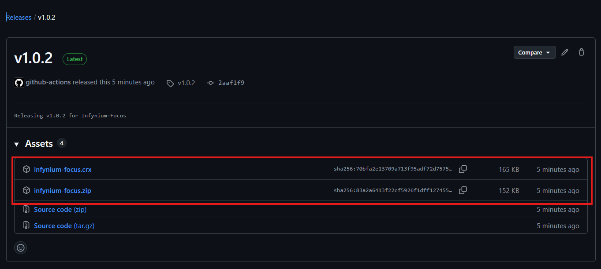

# 🚀 Infynium Focus
*Your brain's new best friend. And your procrastination's worst enemy.*

A completely free and open-source browser extension suite designed to bolt two high-powered productivity engines onto your browser: InfyBlock and InfyDoro.

## Meet Your New Productivity Arsenal 🦾

### 🛡️ InfyBlock
*The no-nonsense digital bouncer for your browser.* Ever get lost in a YouTube rabbit hole when you should be closing a deal? InfyBlock puts a stop to that. It's less of a blocker and more of a focus guardian.
- **Block Everything**: Add an unlimited number of websites to your blocklist. The entire internet, if you must. We won't judge. 🌍🚫
- **You Call the Shots**: Set blocking periods for any duration. An hour, a day, a fortnight. Your focus, your rules. 🗓️
- **Master Your Workflow**: Create custom schedules that align perfectly with your work and life. ✍️

### 🍅 InfyDoro
*The Pomodoro Technique on steroids.* This isn't your average kitchen timer. InfyDoro is a precision-engineered system that slices your work into hyper-focused sprints and tactical breaks.
- **Laser Focus**: Automatically locks down distracting sites the second your focus session begins. 🎯
- **Strategic Breaks**: The moment the timer dings for a break, your websites are magically restored. Go on, watch that cat video. You've earned it. 😺
- **Track Your Wins**: Get hard data on your productivity streaks. See tangible proof of how much you're crushing it. 📊

## Why It's Awesome: The Stark Truth ✨
- **100% Free**: No trials, no "premium" nonsense, no credit card required. Ever. The price is $0. 💸
- **Fully Open Source**: Peek under the hood! The code is all yours to inspect, tweak, or build upon. We're an open book. 📖
- **Privacy First**: We track absolutely nothing. Zero. Zilch. Your data is yours alone. We're not creepy like that. 🕵️‍♂️
- **Feather-Light**: So lightweight, your browser won't even know it's there. No lag, just pure, unadulterated speed. 🕊️
- **Slick & Clean Interface**: A minimalist design with a satisfyingly smooth progress indicator, so you can focus on what matters—not our UI.
- **Infinitely Customizable**: Bend it to your will. Every setting is designed to fit *your* perfect workflow. 🎛️

## Your Mission, Should You Choose to Accept It... 📜

### 🛡️ Taming Distractions with InfyBlock
1.  **Tag 'Em**: Point to the websites that tempt you and add them to the blocklist.
2.  **Set the Clock**: Decide how long they need to stay in the digital penalty box.
3.  **Flip the Switch**: One click is all it takes to activate your focus shield.
4.  **Access Denied**: Try to visit a blocked site and get politely redirected. Nice try, though. 😉
5.  **Change of Heart?**: Easily adjust or remove blocks at any time. You're the boss.

### 🍅 Hacking Time with InfyDoro
1.  **Make a List**: Designate your usual digital time-sinks.
2.  **Dial It In**: Set your ideal focus and break durations.
3.  **Choose Your Rounds**: Line up your work sessions like a champ.
4.  **Lock It In**: Hit "Save" and commit to the plan.
5.  **Engage!**: Start the timer and let the countdown to deep work begin! ⏳
6.  **Zone In**: During focus time, your banned sites are completely inaccessible.
7.  **Breathe**: During breaks, the internet is your oyster again.
8.  **Victory Lap**: Get a notification when you've completed your cycle. Go you! 🎉

## Get It Now (Or Build It Yourself, You Genius) 🤓

### Option 1: Download from Releases 📦
1. Go to the [Releases](https://github.com/naineel1209/infynium-focus/releases) section of this repository
2. Download the latest `.zip` file from the assets
3. Drag and drop the file into your Chrome browser
4. Click "Add Extension" when prompted



### Option 2: Build It Yourself 🛠️
1. Clone this repository or download the source code
   ```bash
   git clone https://github.com/naineel1209/infynium-focus.git
   cd infynium-focus
   ```
2. Install the dependencies: `pnpm install` (or `npm install`)
3. Build the extension: `pnpm build` (or `npm run build`)
4. Load it into your browser:
   - In Chrome, navigate to `chrome://extensions/`
   - Enable **Developer Mode** (toggle in the top-right)
   - Click **"Load unpacked"** and select the `dist` folder from the project
   - The extension should now appear in your browser!

### For the Tinkerers & Builders 🛠️
This project is built with the slick combo of **React, TypeScript, and Vite.** It's a dream to work with. Fire up your terminal and go:
```
npm install
npm run dev
```

### Roadmap & Future Plans 🗺
- **Infy️Block 2.0**: More powerful blocking features, including AI-driven suggestions for sites to block based on your browsing habits. Detailed analytics to show you how much time you're saving.
- **InfyDoro 2.0**: Enhanced Pomodoro features, including customizable sound alerts(think motivational quotes).
- **Cross-Browser Support**: Firefox and Edge versions are in the works. We want everyone to experience the magic of Infynium Focus.

### Join the Cause 🤝
Got ideas? Found a bug? Want to add a world-changing feature? We're all ears. Feel free to submit issues, feature requests, or pull requests. Don't be shy!

### The Legal Stuff (The Good Kind) 📄
This project is open-source and available under the **MIT License**. Now go build something amazing.
